# Analisis Art pada Game 2D

## Pemaparan dua jenis art 2D: pixel art & vector art

Dalam game, visual game biasanya menggunakan 2d pixel art dan vector art. Pixel art dan vektor art adalah dua gaya visual utama dalam desain game, di mana pixel art menggunakan matriks kotak kecil (piksel) yang terlihat jelas untuk menciptakan gambar dengan tampilan retro atau bergaya 8-bit/16-bit, sedangkan vektor art menggunakan persamaan matematika untuk membentuk garis, kurva, dan bentuk yang dapat diskalakan tanpa kehilangan kualitas. Keduanya populer dalam visualisasi game karena alasan yang berbeda: pixel art menawarkan nostalgia, gaya yang khas, dan ringan untuk aset game (mengurangi beban pemrosesan), sementara vektor art memungkinkan aset yang tajam dan mudah diubah ukurannya untuk berbagai resolusi dan platform, serta sangat cocok untuk tampilan yang bersih dan bergaya kartun.

## Analisis contoh game dari kedua jenis art

Terkadang semakin detail pixel art , maka akan terlihat seperti 2d vektor art namun terdapat perbedaan signifikan dari kedua tipe tersebut , yaitu shading. Shading pixel art terkesan tidak terlalu menyatu dan menghasilkan gradasi yang tidak smooth , sedangkan shading vector art seperti memiliki tektur yang halus dan . Hal inilah yang menjadi pembeda bagi pixel art dan vector art

|             | Pixel Art                                                               | Vector Art                                                              |
| ----------- | ----------------------------------------------------------------------- | ----------------------------------------------------------------------- |
| Game        | 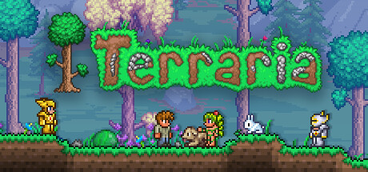</img> | 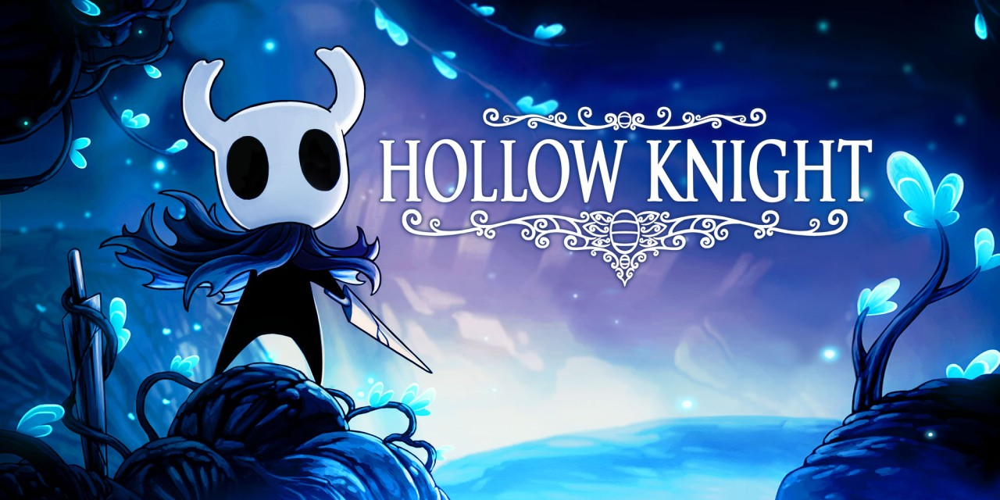</img> |
| Environment | 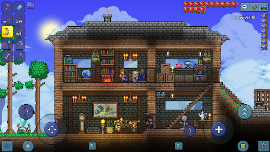</img> | 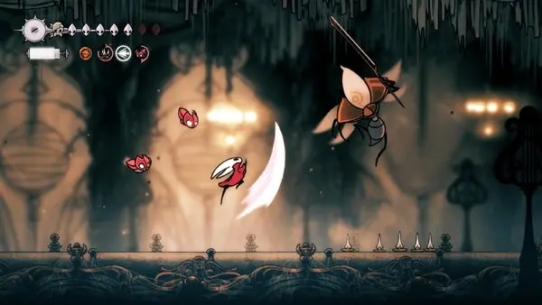</img> |
| Character   |                          |                          |
| UI          | 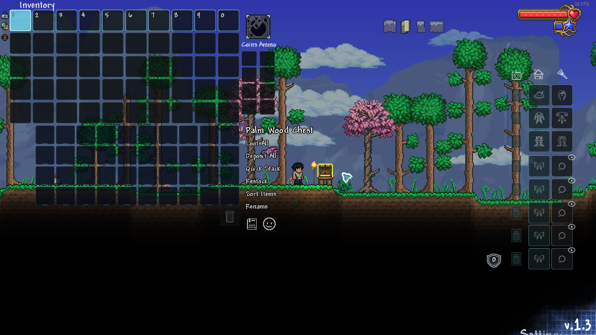</img> | 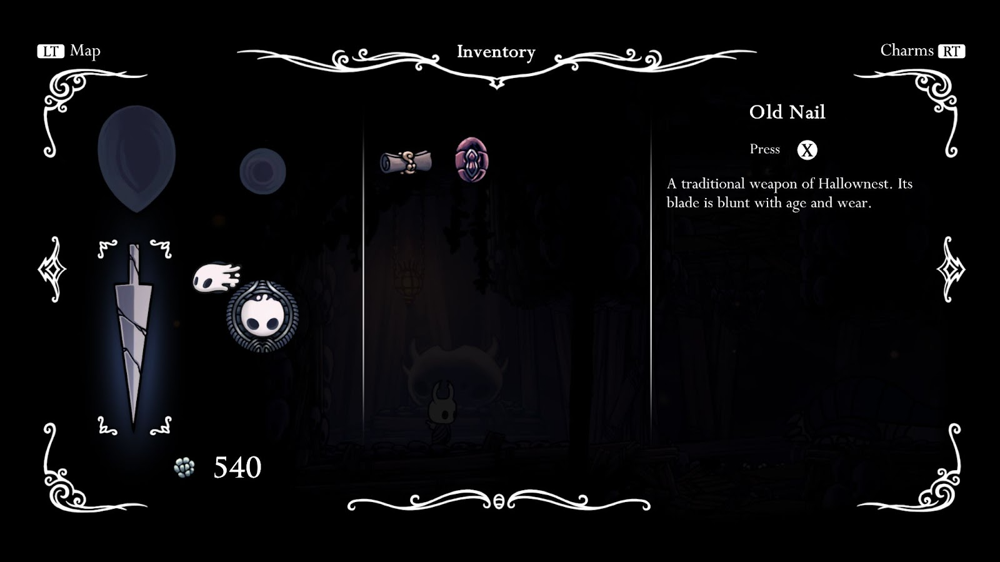</img> |

## Garis

Pixel Art garisnya tersusun dari piksel atau kotak-kotak berwarna, sehingga garis miring terlihat bergerigi (jaggies); sedangkan gambar di kanan adalah Vector Art (grafis vektor) yang garisnya selalu halus, tajam, dan mulus bahkan ketika diperbesar, karena ia tidak mengandalkan piksel tetap untuk membentuk bentuknya

| Pixel Art                                                          | Vector Art                                                         |
| ------------------------------------------------------------------ | ------------------------------------------------------------------ |
| 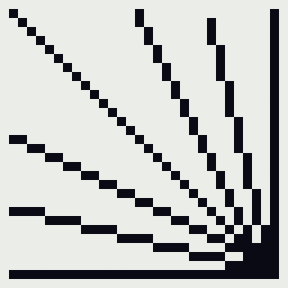 | 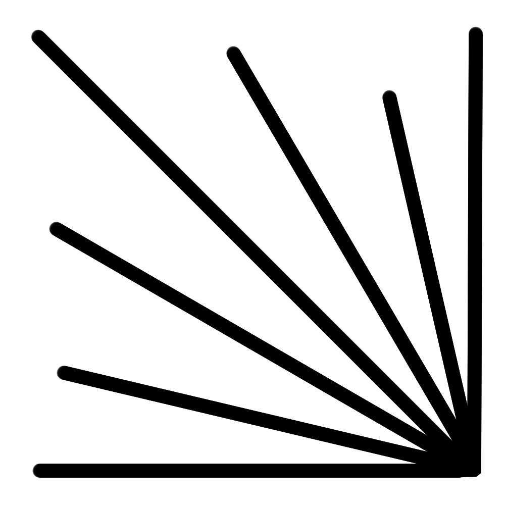 |

## Bentuk
### 1 Bangun Datar.

| Pixel Art                                                                      | Vector Art                                                                     |
| ------------------------------------------------------------------------------ | ------------------------------------------------------------------------------ |
| 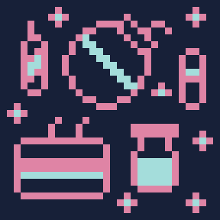 | 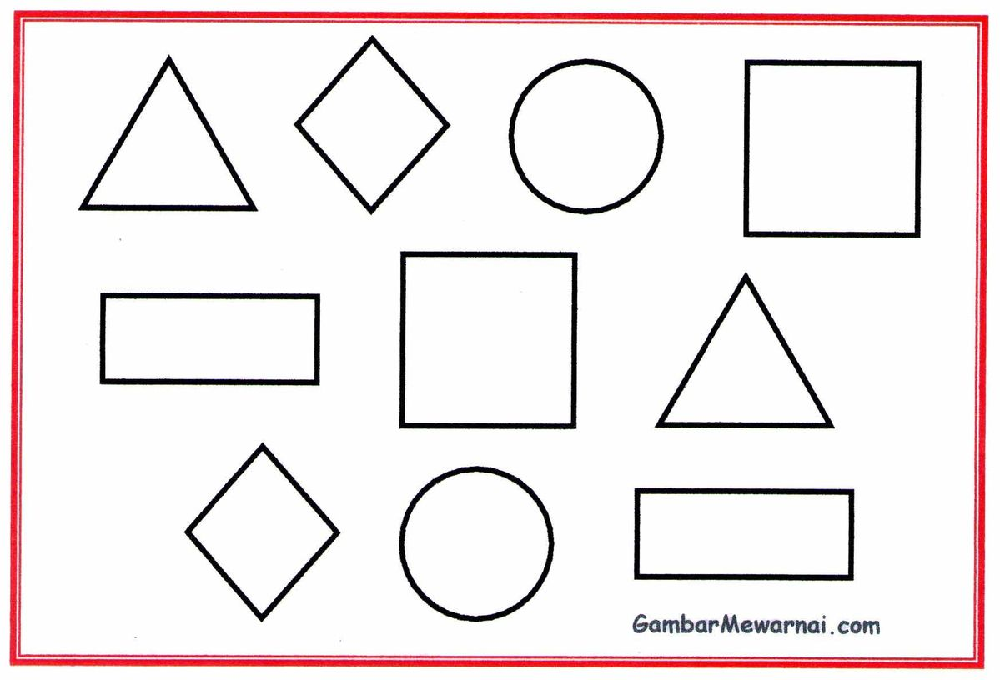 |

### 2 Bangun Ruang

| Pixel Art                                                                      | Vector Art                                                                     |
| ------------------------------------------------------------------------------ | ------------------------------------------------------------------------------ |
| 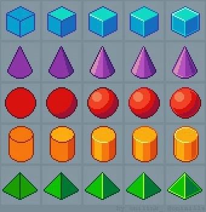 | 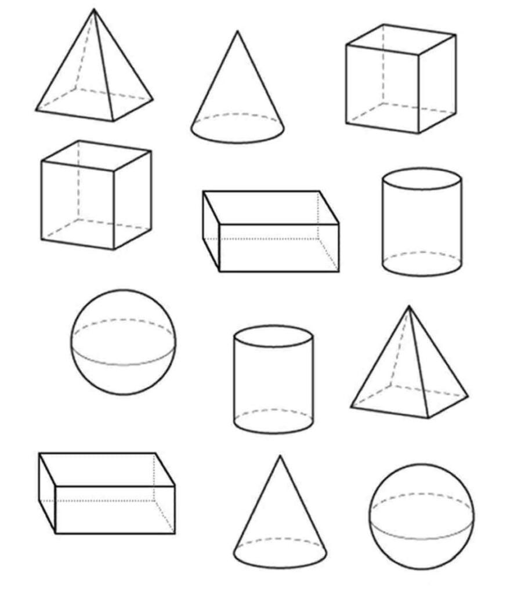 |
  
3. Shade
    

  

4. Pixel Art 
    
5. Vector Art 
    

  
  

6. Perspective
    

  

|   |   |   |
|---|---|---|
||Pixel Art|Vector Art|
|Top down|||
|platformer|||
|isometric|||

  

## Warna

  

5. Hue.
    

  

Hue merupakan sebuah istilah untuk menggambarkan nama dari warna - warna yang ada. Contoh dalam lingkaran warna itu terbentuk dari 3 warna dasar, yaitu : Red, Yellow, dan Blue. dari ketiga warna dasar tersebut bila dicampurkan masing-masing warna nya maka akan timbul gradasi warna. dan warna gradasi itulah yang tidak diketahui nama warna nya itu disebut dengan HUE.

  

  

6. Brightness vs Value.
    

  

|   |   |
|---|---|
|Brightness / lightness|value|
|1. Kualitas visual yang membuat suatu objek tampak lebih terang atau lebih gelap dibandingkan sekitarnya.      2. Mempengaruhi persepsi intensitas cahaya pada objek.|1. Tingkat gelap-terang suatu rona (warna), mulai dari putih ke hitam.      2. Menciptakan ilusi bentuk (volume) dan ruang (kedalaman), serta kontras visual.|

  

  

7. Saturation.
    

  

Saturation adalah Intensitas warna atau sebuah kemurnian dari warna. saturation itu sederhananya Kepekatan warna / lemah atau kuatnya sebuah warna. Contoh warna merah terang sempurna itu artinya intensitas tinggi, namun bila intensitas rendah warna tersebut.

Rentang Intensitas dari sebuah warna dinyatakan dalam sebuah persen(%) yaitu (Grey) 0% - 100%. maka 100% artinya warna tersebut sangat Cerah/Full Saturation.

  

|   |   |
|---|---|
|high saturation|low saturation|
|||

  

  

8. Color Palette
    

  

Color palette penting untuk menyeragamkan saturasi , warna , dan menciptakan harmoni dalam sebuah karya, aset , atau visual. Dapat dilihat pada tabel di bawah ini perbedaan antara menggunakan COlor Palette dan tidak.

  

|   |   |
|---|---|
|With|Without|
|||

  

Pada gambar yang tidak menggunakan palette warna gambar seakan flat dan tidak memiliki harmoni untuk visual yang lebih menyenangkan untuk dilihat. Sedangkan yang menggunakan palette warna terdapat kesan visual yang ingin ditonjolkan dan harmoni warna yang menonjol. Serta palette warna dapat memberikan kesan yang ingin kita dapatkan seperti senang , sedih , tegang , gembira dll.

  

contoh : 

  

|   |   |
|---|---|
|Suasana|Palette warna|
|horror / gloomy / dark / misteri / gore / dark fantasy / low saturated||
|ceria / fun / light fantasy / cute / happy||

1. adobe color (https://color.adobe.com/explore)
    

suruh login dulu buset dah.  kalau tak kunjung sign in anda akan dibawa ke tampilan sign in

format terdownload : 

  

2. Lospec (https://lospec.com/palette-list)
    

Lospec menawarkan banyak palette , tanpa sign in , dan bisa langsung di download. jujur ini enak banget  buat nyari color palette pixel art

format terdownload : 

  

3. color io
    

prosesnya membuat akun terlebih dahulu baru bisa menjelajahi palette warna di web tersebut. [color.io](http://color.io) bisa diinstall menjadi bentuk aplikasi. color io lebih ke aplikasi color grading. 

  

4. coolors (https://coolors.co/palettes/trending)
    

website ini dapat membuat color palette dari gambar yang kita unggah. banyak pop up nya sih

  

  

dapat diekspor dalam berbagai format.

  
  
**